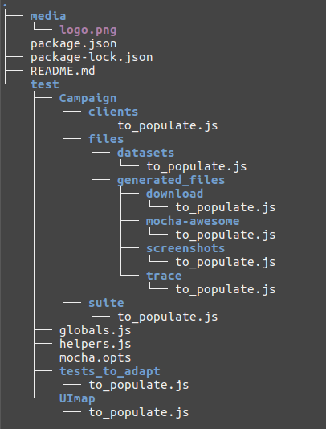

[](https://www.prestashop.com)


# How to Install Geppetto project
Clone this repo and run them directy with a simple `node` command.

```bash
git clone https://github.com/mbadrani/geppettov2.git
cd geppettov2
npm i
```
#### First example launch Installation test
If you want to run the Install test you can run the script **installPrestashop**
```
node test/not_mocha/installPrestashop.js --URL UrlOfShop --LANG language --COUNTRY country --DB_SERVER dataBaseServer --DB_USER dataBaseUsername --DB_PASSWD dataBasePassword --ADMIN_FOLDER_NAME adminFolderName --INSTALL_FOLDER_NAME installFolderName
```
If you want to run the Install test on release version you can run this script

>Notes: This script will

> 1) Download a release
> 2) Copy the ZIP file in RC_TARGET
> 3) Extract the zip file to *prestashop* folder,
> 3) Rename the folders admin to admin-dev and install to install-dev
```
node test/not_mocha/installPrestashop.js --LANG language --COUNTRY country --DB_SERVER dataBaseServer --DB_USER dataBaseUsername --DB_PASSWD dataBasePassword --RC_TARGET pathOfReleaseTarget --UrlStableVersion urlOfPrestashopRelease --ADMIN_FOLDER_NAME adminFolderName --INSTALL_FOLDER_NAME installFolderName
```

#### Second example launch PR tests

If you want to run all the prestashop automated Pull Requests tests you can run the campaign **PR**

```
npm run PR -- --URL='http://127.0.0.1:8081/prestashop' --ADMIN_FOLDER_NAME adminFolderName
```

#### Third example launch specific test

If you want to run mocha test only on specific parts (for example PR 9095), you have to run this command:

```
TEST_PATH=PR/9095.js npm run specific-test -- --URL='http://127.0.0.1:8081/prestashop' --ADMIN_FOLDER_NAME adminFolderName
```

Use `TEST_PATH` environment variable to specify which test you want to run.

If you want to run not mocha test only on specific parts (for example PR 8237), you have to run this command:

```
node test/not_mocha/PR/8237.js --URL 'http://127.0.0.1:8081/prestashop' --ADMIN_FOLDER_NAME adminFolderName
```

#### The architecture of the project

