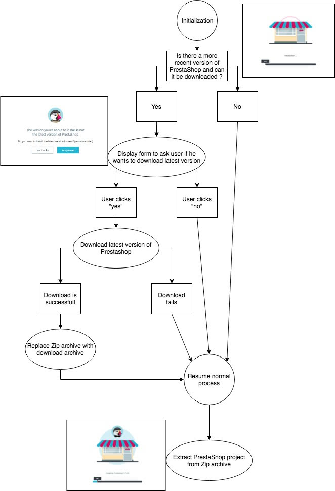

# PrestaShop Release Creation

## New release generation

### Prerequisite

This tool needs these system commands:

- git
- rm
- mv
- mkdir
- du
- cd
- php
- cut

### Install and use

To create a release:

```
php tools/build/CreateRelease.php --version="1.7.2.4"
```

Available options:
* --version: Desired release version of PrestaShop. Required.
* --no-installer: Do not put the installer in the release. Default: false.
* --no-zip: Do not zip the release directory. Default: false.
* --destination-dir: Path where the release will be stored. Default: tools/build/releases/prestashop_{version}.
* --help: Show help.

This will:

* Export project with git archive to a temp location
* Define constants (`_PS_MODE_DEV_` to false etc...)
* Concatenate all licence files into one unique in {project_root}/LICENCES
* Create somes folders (var/cache, var/logs...)
* Clean project files and directories
* Zip release if no --no-zip arg
* Add the installer if no --no-installer arg
* Move the generated release to {project_root}/tools/build/releases or another directory if --destination-dir arg provided

### Output: release zip archive

The output is a zip archive which contains:
- PrestaShop pre-installer
- the prestashop shop zip archive
- an HTML documentation

This is what is given to merchants who download Prestashop from the prestashop website
in order to install it on their server.

## Prestashop pre-installer

PrestaShop pre-installer is a single `index.php` file in charge of unzipping the shop code from
the zip archive (which contains PrestaShop code and PrestaShop installer).

### Insights

The pre-installer must be a single-file single-page web application although it is powered by a php backend, a jquery
frontend and some assets. In order to achieve this, the tool `tools/build/CreateRelease.php` bundles
all code and assets into a single file.

Consequently all AJAX queries target the same file, with different `GET` and `POST` parameters.

In details:
- `index.php` call runs the php file which outputs HTML and javascript to be run by the browser
- the browser then loads assets using URLs such as `index.php?element=jquery`, `index.php?element=css`,
`index.php?element=css`
- the browser runs the javascript code which performs ajax calls such as `POST index.php` which
triggers php routines on backend side


Here are the "available routes" provided by `index.php`:
- `GET index.php` : displays the pre-installer page and run the javascript pre-installer app
- `GET index.php?run=check-version` : checks whether there is a more recent version of PrestaShop and if it can be downloaded
- `POST index.php { extract: true, startId: startId }` : performs the zip extraction process
- `POST index.php  {downloadLatest: true}` : performs the download of the latest PS version process
- `GET index.php?element=[...]` : loads the requested asset

### Workflow

Here is the workflow followed by the JS app:



> This diagram has been drawn using [www.draw.io](www.draw.io). If you wish to edit it, use
the [diagram source file](https://github.com/PrestaShop/PrestaShop/blob/develop/tools/build/pre-installer-diagram-src.xml).
